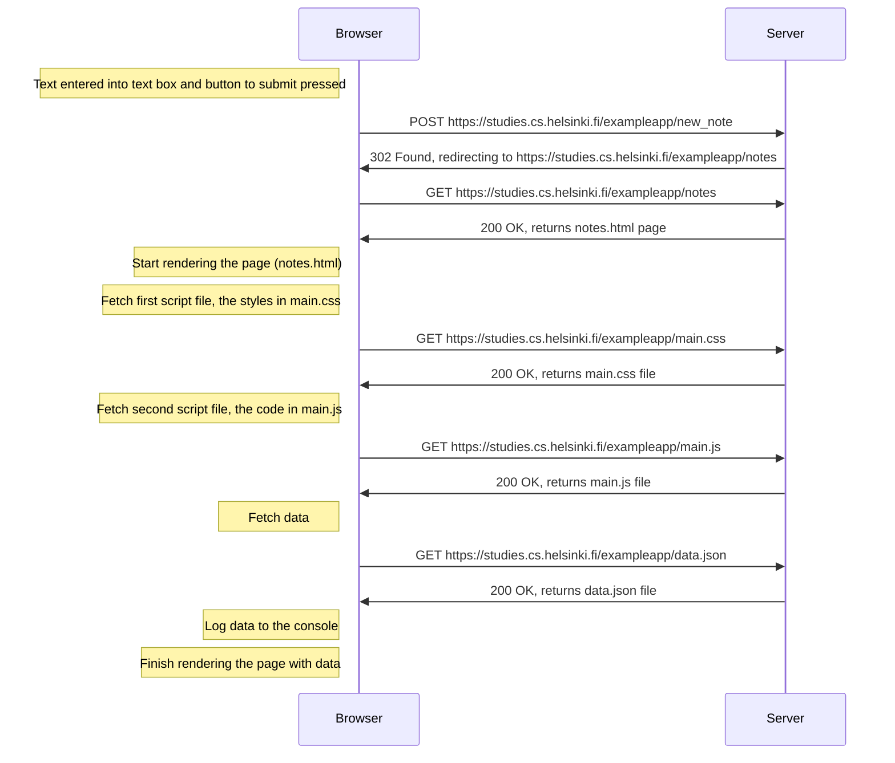

```mermaid
sequenceDiagram
  participant B as Browser
  participant S as Server
  Note left of B: Text entered into text box and button to submit pressed
  B ->> S: POST https://studies.cs.helsinki.fi/exampleapp/new_note
  S ->> B: 302 Found, redirecting to https://studies.cs.helsinki.fi/exampleapp/notes
  B ->> S: GET https://studies.cs.helsinki.fi/exampleapp/notes
  S ->> B: 200 OK, returns notes.html page
  Note left of B: Start rendering the page (notes.html)
  Note left of B: Fetch first script file, the styles in main.css
  B ->> S: GET https://studies.cs.helsinki.fi/exampleapp/main.css
  S ->> B: 200 OK, returns main.css file
  Note left of B: Fetch second script file, the code in main.js
  B ->> S: GET https://studies.cs.helsinki.fi/exampleapp/main.js
  S ->> B: 200 OK, returns main.js file
  Note left of B: Fetch data
  B ->> S: GET https://studies.cs.helsinki.fi/exampleapp/data.json
  S ->> B: 200 OK, returns data.json file
  Note left of B: Log data to the console
  Note left of B: Finish rendering the page with data
```
