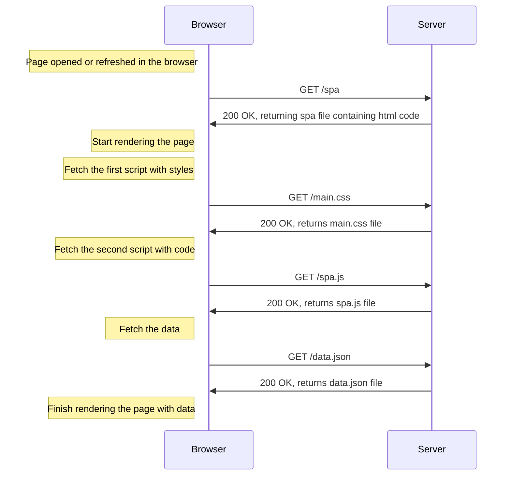

# Opening https://studies.cs.helsinki.fi/exampleapp/spa
Note: all routes are in relation to the base URL https://studies.cs.helsinki.fi/exampleapp

```mermaid
sequenceDiagram
  participant B as Browser
  participant S as Server
  Note left of B: Page opened or refreshed in the browser
  B ->> S: GET /spa
  S ->> B: 200 OK, returning spa file containing html code
  Note left of B: Start rendering the page
  Note left of B: Fetch the first script with styles
  B ->> S: GET /main.css
  S ->> B: 200 OK, returns main.css file
  Note left of B: Fetch the second script with code
  B ->> S: GET /spa.js
  S ->> B: 200 OK, returns spa.js file
  Note left of B: Fetch the data
  B ->> S: GET /data.json
  S ->> B: 200 OK, returns data.json file
  Note left of B: Finish rendering the page with data
```
